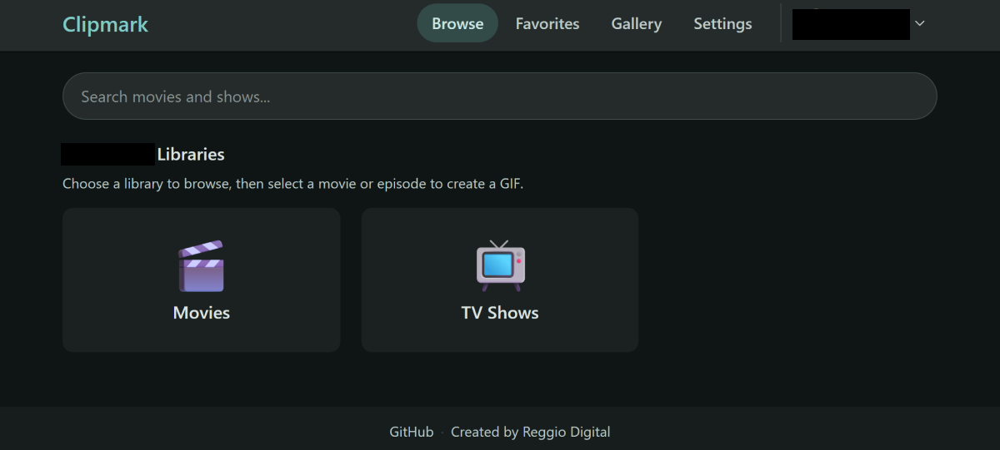
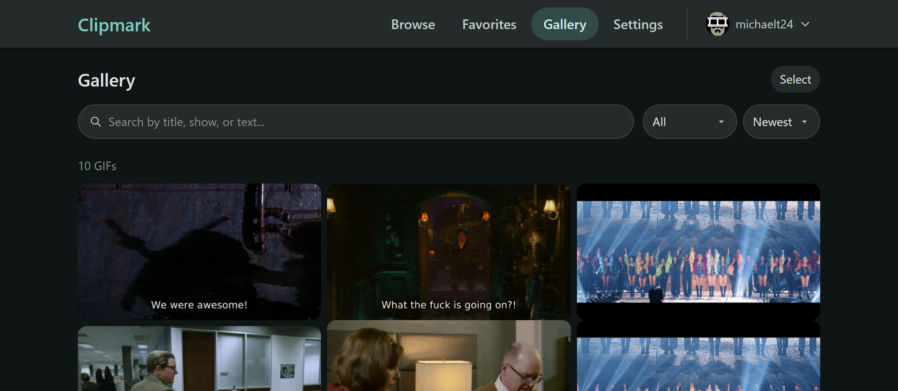
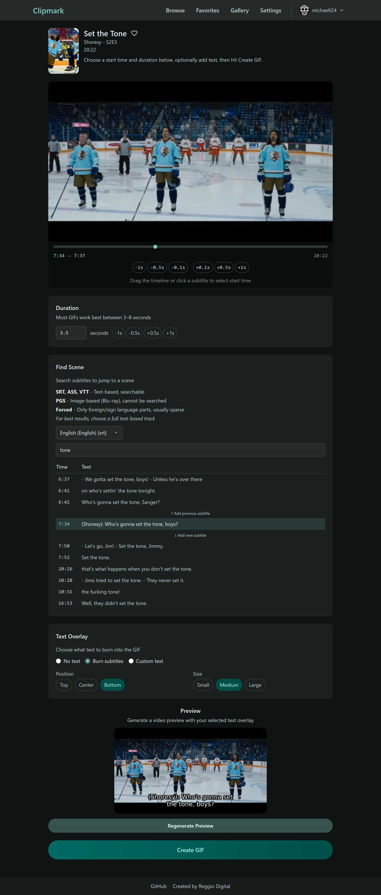

# Clipmark

Create GIF clips from your Plex media library. Self-hosted, single-container. Optional integrations.

## Features

- **Browse & Search** - Navigate your Plex libraries or search by title
- **Subtitle Navigation** - Click subtitle lines to jump to that moment
- **Clip Start & Duration** - Choose where the clip begins and how long it runs, with frame preview
- **GIF Generation** - Create GIFs with optional subtitle burn-in or custom text
- **Gallery** - View, download, and manage your created GIFs
- **GIPHY Upload** - Upload GIFs directly to GIPHY (optional)

## Screenshots







## Quick Start

```bash
docker run -d -p 8000:8000 -v ./data:/data --name clipmark ghcr.io/reggio-digital/clipmark:latest
```

Open http://localhost:8000 and connect your Plex account.

> **Note:** Plex Media Server must be reachable from the container.

## Docker Compose

```yaml
services:
  clipmark:
    image: ghcr.io/reggio-digital/clipmark:latest
    container_name: clipmark
    ports:
      - "8000:8000"
    volumes:
      - ./data:/data
    restart: unless-stopped
```

### Docker Run

```bash
docker run -d \
  -p 8000:8000 \
  -v ./data:/data \
  --name clipmark \
  ghcr.io/reggio-digital/clipmark:latest
```

## Requirements

- Docker
- Plex Media Server (accessible from the container)

## Configuration

Environment variables (all optional):

| Variable | Default | Description |
|----------|---------|-------------|
|`DATA_DIR` | `/data` | Persistent storage path |
| `MAX_CONCURRENT_JOBS` | `1` | Parallel FFmpeg jobs |
| `MAX_QUEUED_JOBS` | `10` | Max pending jobs |
| `MAX_QUEUED_JOBS_PER_USER` | `3` | Max pending jobs per user |
| `MAX_GIF_DURATION_SECONDS` | `15` | Max GIF length |
| `MAX_PREVIEW_DURATION_SECONDS` | `10` | Max preview length |
| `MAX_WIDTH` | `480` | Max output width (pixels) |
| `MAX_FPS` | `10` | Max frame rate |
| `FRAME_CACHE_TTL_MINUTES` | `30` | Frame cache lifetime |
| `PREVIEW_CACHE_TTL_MINUTES` | `30` | Preview cache lifetime |
| `FAILED_WORKSPACE_TTL_HOURS` | `24` | Failed job cleanup delay |
| `FFMPEG_TIMEOUT_SECONDS` | `300` | FFmpeg process timeout |

Output defaults are 480px width and 10 FPS. Environment variables define upper limits, not per-GIF defaults.

### App Settings (config.json)

These are managed via the admin UI and stored in `data/config.json`:

| Setting | Default | Description |
|---------|---------|-------------|
| `gifsicle_enabled` | `true` | Enable gifsicle GIF compression |
| `gifsicle_lossy` | `100` | Lossy compression level (0-200) |
| `public_sharing_enabled` | `false` | Allow public GIF sharing via link |
| `giphy_global_enabled` | `true` | Allow users to upload to GIPHY |
| `max_gif_duration_seconds` | `15` | Default max GIF duration |
| `max_width` | `480` | Default max output width |
| `max_fps` | `10` | Default max frame rate |
| `browse_page_size` | `48` | Items per page when browsing |

## Data Storage

Mount `/data` as a volume. Contains:

```
/data/
├── config.json       # Plex token (treat as secret)
├── clipmark.db       # SQLite database
├── cache/
│   ├── frames/       # Extracted video frames
│   ├── previews/     # GIF previews
│   ├── thumbnails/   # Media thumbnails
│   └── subtitles/    # Parsed subtitle data
├── work/             # Job workspaces (auto-cleaned)
└── output/           # Generated GIFs
```

## GIPHY Integration

Clipmark can upload your GIFs directly to GIPHY. To enable this:

1. Create a free account at [developers.giphy.com](https://developers.giphy.com/)
2. Create an app to get an API key
3. Go to **Settings** in Clipmark and enter your API key

Once configured, a GIPHY upload button appears on completed GIFs in the gallery. Uploaded GIFs follow GIPHY's standard review and visibility rules.

## GIF Optimization

Clipmark uses gifsicle to reduce GIF file sizes by 20-40%. This is enabled by default and can be configured in **Settings**:

- **Enable/disable** — Toggle optimization on or off
- **Lossy compression** — Adjust quality vs size (0-200, default 100)

Higher lossy values = more compression = smaller files but more artifacts.

## Subtitles

Clipmark detects subtitles associated with Plex items (sidecar or embedded). If no subtitles appear for your media:

1. **Check Plex first** — Open the media in Plex and verify subtitles are available there
2. **Search in Plex** — Plex can [search for and download subtitles](https://support.plex.tv/articles/subtitle-search/) directly from the media detail page
3. **Add external subtitles** — [Place `.srt` files](https://support.plex.tv/articles/200471133-adding-local-subtitles-to-your-media/) alongside your media files with matching names (e.g., `Movie.mp4` → `Movie.srt` or `Movie.en.srt`), then refresh the library in Plex
4. **Embedded subtitles** — These are automatically detected if present in the media file

**Supported formats for burn-in:**
- SRT, ASS/SSA, WebVTT — Full support (text-based)
- PGS, DVD subtitles — Detected but cannot be burned into GIFs (image-based bitmap subtitles)

If your media only has PGS/DVD bitmap subtitles, convert to SRT (via OCR tools) or use custom text overlay instead.

> **Tip:** [Bazarr](https://www.bazarr.media/) can automatically find and download subtitles across your entire library. It's a great companion if you want subtitles available without manually searching in Plex for each title.

## Development

First-time setup:

```bash
# Frontend
cd frontend && npm install

# Backend
cd backend && python3 -m venv venv && ./venv/bin/pip install -r requirements.txt
```

Then from the `frontend/` directory:

```bash
npm run dev
```

This starts both the backend (port 8000) and frontend dev server (port 5173) with hot reload. You can also run `npm run dev` from the project root, which delegates to the frontend script.

### Build Docker Image

```bash
docker build -t clipmark .
```

## Tech Stack

- **Frontend**: React, TypeScript, Vite, Tailwind CSS
- **Backend**: Python, FastAPI, SQLAlchemy, SQLite
- **Plex**: python-plexapi
- **Media**: FFmpeg, gifsicle

## Security Notes

- Plex token stored server-side, never sent to browser
- If exposing to the internet, use a reverse proxy with HTTPS

## License

MIT — see [LICENSE](LICENSE) for details.
